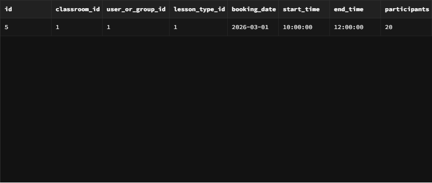
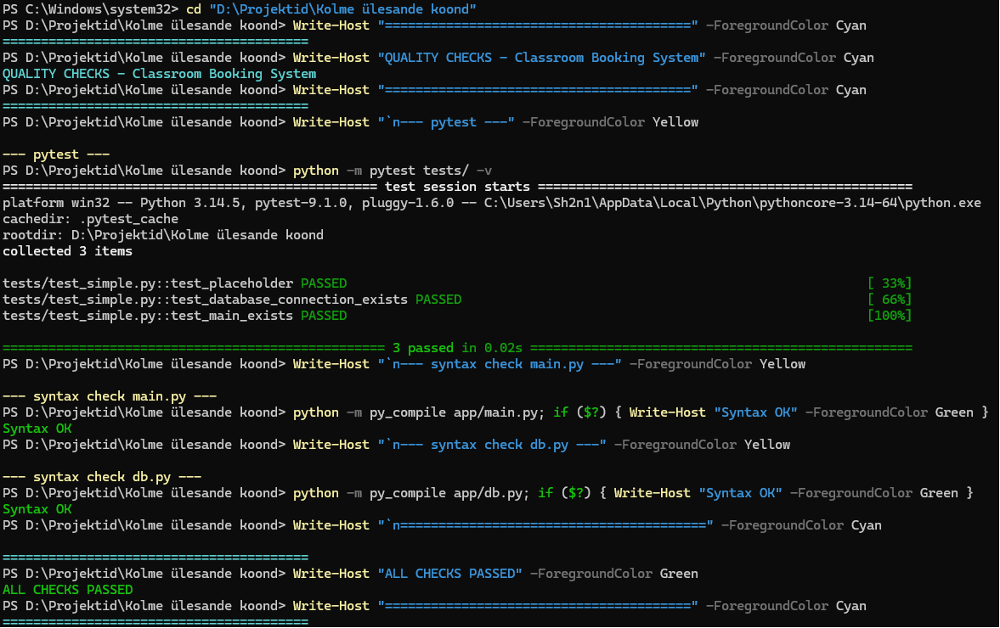
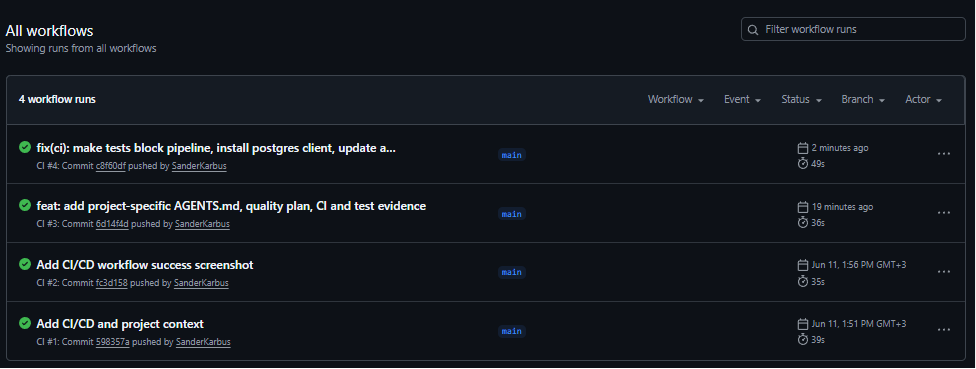
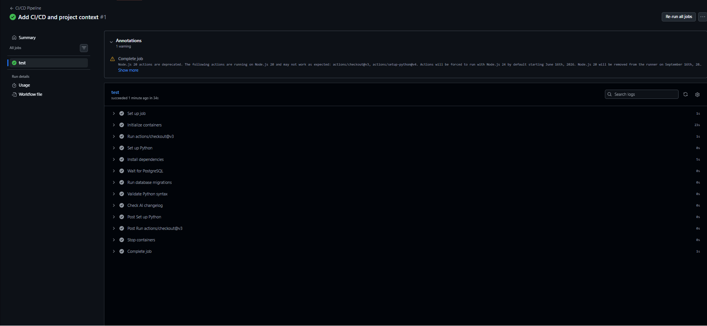
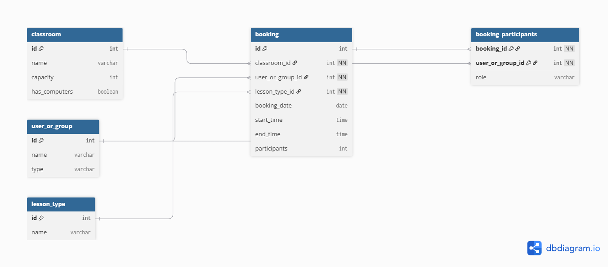
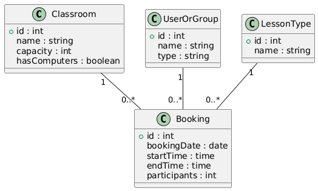

# classroom-booking-system
database

# Import (CSV + JSON + XML)

This folder contains import files required by the assignment.

## 1) CSV import
- classes.csv (classrooms)

Imported with SQL COPY or database import tools.

## 2) JSON import
- teachers.json (users + user groups)
- import_teachers.sql (SQL script that inserts groups and users)

## 3) XML import
- bookings.xml (bookings)
- import_bookings.py (example script that parses XML and inserts into PostgreSQL)

Note: The XML import script is provided as a working example; the assignment requires the XML format and import logic to be present.

## CRUD functionality

Basic CRUD operations are demonstrated using SQL queries in `crud.sql`.

### Application type

The database application is implemented as a simple CLI-based solution using SQL queries.
CRUD operations and a statistical view are demonstrated without a graphical user interface.

## CRUD Demonstration

### Read bookings

### Classroom usage statistics

## Quality Assurance

### Test results

### CI/CD Workflow

### CI/CD Workflow (earlier)

## Database Design

### ERD Diagram

### UML Class Diagram

